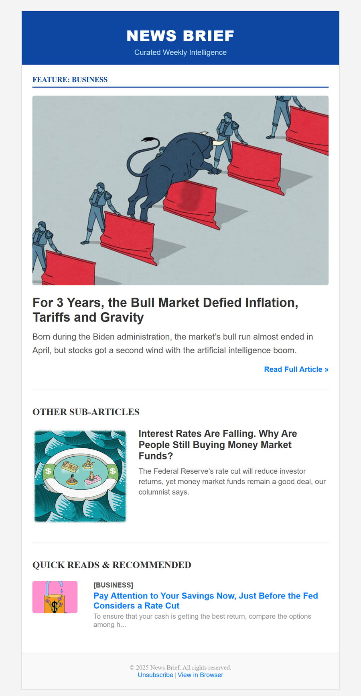
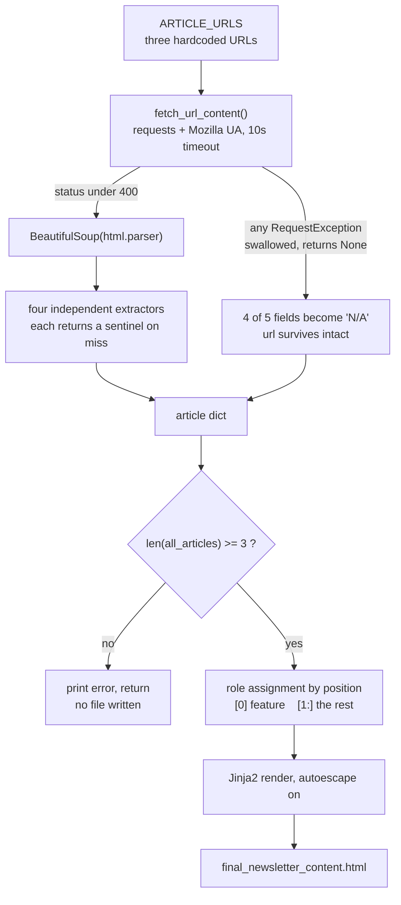

# Newsletter Brief Generator

Turns three article URLs into a finished, email-client-safe HTML newsletter in one command — scraping the headline, standfirst, hero image and section from each page, then rendering them into a table-layout brief with a designed editorial hierarchy.


There is no hosted demo — this is a local CLI that writes a file. So here is the file it writes:

<p align="center">
  
</p>

<p align="center"><em>
  <code>final_newsletter_content.html</code>, rendered in a browser. Committed output, real scraped content.
</em></p>

---

## The problem

Assembling a curated newsletter is mechanical, repetitive work. An editor picks a handful of articles, then hand-copies each headline, each standfirst, each hero image URL and each section label into an email template — and gets the HTML subtly wrong, because email HTML is not web HTML and hasn't been since about 2003.

This automates the copying and removes the chance to get the template wrong. The editor's only input is a list of URLs.

## How it works

```python
ARTICLE_URLS: List[str] = [
    "https://www.nytimes.com/2025/10/17/business/bull-market-trump-biden.html",
    "https://www.nytimes.com/2025/10/31/business/interest-rates-money-markets-stocks-bonds.html",
    "https://www.nytimes.com/2025/10/24/business/interest-rates-cds-savings-accounts.html",
]
```

`python scraper.py` fetches each page, parses it with BeautifulSoup, and pulls four fields using four different selectors:

| Field | Selector | What kind of hook this is |
|---|---|---|
| Headline | `[data-testid="headline"]` | Test hook — deliberate, stable |
| Standfirst | `#article-summary` | Semantic ID — deliberate, stable |
| Hero image | `img.css-rq4mmj` | Generated CSS hash — incidental |
| Section | `a.css-nuvmzp` | Generated CSS hash — incidental |

The three results are then assigned newsletter roles and rendered through a Jinja2 template into `final_newsletter_content.html`.



## The interesting part: failing softly against selectors you don't own

The core problem in this project isn't parsing HTML. It's that **every selector is a contract with someone who never agreed to it.** NYT can redeploy at any moment and owes this scraper nothing.

Look at the four hooks again. Two of them — `data-testid="headline"` and `id="article-summary"` — are things a developer wrote on purpose and is unlikely to churn casually. The other two — `css-rq4mmj`, `css-nuvmzp` — are CSS-in-JS class hashes. They are *build output*. Nobody owns them, nobody is stopping them from changing, and their exact value is an accident of a compiler run.

So the design question is not "how do I write selectors that never break" — you can't, two of these were never yours. It's **"what happens on the day one of them breaks?"**

The answer is a contract every extractor keeps:

```python
def extract_section(soup: BeautifulSoup) -> str:
    """Finds the article section/category using its unique CSS class."""
    section_tag = soup.find('a', class_='css-nuvmzp')
    if section_tag:
        return section_tag.text.strip()
    return "Section Not Found"
```

All four extractors hold that contract — *never raise, always return a `str`, sentinel on miss* — though only three share this exact find-and-strip body. `extract_image_url` reads an attribute rather than text, normalises protocol-relative `//` URLs to `https:`, and reaches `"Image Not Found"` from two directions: no `` at all, or an `` with an empty `src`. Different body, same guarantee. `fetch_url_content` mirrors it once more by returning `None` rather than propagating the exception.

The consequence is that failure is **per-field, not per-run**. One dead selector costs you one field. The other three still populate, the template still renders, and you still get a newsletter.

### This is not hypothetical — here is what nine months did to it

Probing the live NYT markup on **16 August 2026**, against a project last committed **2 November 2025**:

```
art1: HTTP 403  headline=N  summary=N  img=N  section=N
art2: HTTP 200  headline=Y  summary=Y  img=Y  section=N
art3: HTTP 200  headline=Y  summary=Y  img=Y  section=N
```

Both predictions landed:

- **`a.css-nuvmzp` is gone.** The section hash rotted within nine months, on every article. The two semantic hooks survived untouched.
- **`img.css-rq4mmj` survived.** Worth being honest about — hash classes aren't uniformly doomed, they're just unowned. This one happened not to churn.
- **NYT now intermittently returns 403.** The same URL that returned 200 on the first probe returned 403 minutes later.

And the fail-soft design did exactly its job. Nine months of drift, one dead selector and an HTTP 403, and the run still produced a complete, valid HTML file. For the two articles that fetched cleanly, the headline, standfirst and image all populated normally — only the label changed, from `[BUSINESS]` to `[SECTION NOT FOUND]`.

### The flip side, stated honestly

Graceful degradation and silent corruption are the same mechanism viewed from different angles, and this code sits on the wrong side of that line in one specific place.

When `fetch_url_content` catches the 403, it returns `None` — and its only diagnostic `print` is commented out:

```python
except requests.exceptions.RequestException as e:
    # print(f"❌ Error fetching the URL {url}: {e}") # Comment out for cleaner output
    return None
```

So a fully failed article silently keeps its initialised values — four of its five fields become the string `"N/A"` — and the template renders it without complaint. The one field that survives is `url`, because it was populated from the argument before the fetch was ever attempted. That's a small mercy: the links still point somewhere real.

Everything else does not. The verified result of the 403 above, where the *feature* article was the one that failed: **five `N/A` strings in the rendered output and a literal ``** — a broken hero image in a newsletter that reported success and exited cleanly. (Five is the count for a failed feature or quick-read slot; a failed sub-article yields four, since that block never renders a section label.)

Fail-soft is the right instinct for a scraper. It needed one more thing to be complete: *degrade the output, but never degrade the report.* The fix is small and doesn't change the resilience — restore that `print` to `stderr`, and have `generate_newsletter_html` count sentinel values and warn before writing.

## Two smaller decisions worth noting

**Paste order is the layout hierarchy.** There is no config file, no priority field, no tagging UI. The order the editor pastes URLs *is* the editorial ranking:

```python
main_article = all_articles[0]
other_articles = all_articles[1:]
```

Index 0 becomes the full-width feature, index 1 the sub-article, index 2 the quick read. For a tool whose user is an editor rather than an engineer, "reorder your list" is a better interface than any settings screen.

**The `truncate` filter is deliberately overridden.** Jinja2 ships a `truncate`, and this replaces it:

```python
env.filters['truncate'] = lambda s, length, killwords: s[:length] + ('...' if len(s) > length else '')
```

That's not redundant — Jinja's built-in has a `leeway` of 5 characters and won't cut an 82-character string at length 80 at all, and it reserves the `"..."` inside the budget rather than adding it on top. This version is an unconditional hard cut, which is what a fixed-height email cell actually needs. The visible cost is mid-word cuts, which you can see in the screenshot above: *"compare the options among h..."*.

## Running it

```bash
pip install -r requirements.txt
python scraper.py
open final_newsletter_content.html      # or just double-click it
```

To change the contents, edit `ARTICLE_URLS` at the top of [`scraper.py`](scraper.py). Give it **at least three** URLs: with fewer, the `len(all_articles) < 3` guard aborts before writing anything; with more, the extras are silently ignored, because the template only ever references `other_articles[0]` and `other_articles[1]`.

> **On Windows:** the success message *begins* with a `✅`, which raises `UnicodeEncodeError` on consoles using the default cp1252 encoding. It fires at `scraper.py:146` — the first of three trailing `print` calls, so the two after it never run — and crucially *after* the `with open(...)` block has already written and closed the HTML. The file is complete and correct; only the exit code is wrong. Run `set PYTHONIOENCODING=utf-8` first for a clean exit.

## Tradeoffs and known weaknesses

Written after re-reading the source and re-running it, not from memory.

| # | Issue | Why it matters | The fix I'd apply |
|---|---|---|---|
| 1 | **Fetch errors are silent** — the diagnostic `print` in `fetch_url_content` is commented out | A 403 or timeout leaves four of an article's five fields as `"N/A"` and emits a literal ``, while the script still prints `✅ SUCCESS` | Log to `stderr`, and make `generate_newsletter_html` count sentinels and refuse (or loudly warn) above a threshold |
| 2 | **Two selectors depend on CSS hashes** | `a.css-nuvmzp` is already dead as of Aug 2026, confirmed above | Fall back through a chain — `<meta property="article:section">` and JSON-LD both carry the section and are far more stable than a class hash |
| 3 | **Article count is hard-wired into the template** | The guard only checks `< 3`, but the template indexes `other_articles[0]` and `[1]` directly — so a 4-URL list passes validation and silently drops the 4th | Loop over `other_articles` in the template; drive counts from the data, not from hardcoded indices |
| 4 | **Not responsive** — zero `@media` rules, fixed `width="600"` | The layout can't restack on narrow screens; mobile clients shrink the whole brief instead of reflowing it | A `@media (max-width: 600px)` block forcing the image cells to `display: block; width: 100%` |
| 5 | **`font-family` doesn't cover the layout elements** | The single rule targets `h1, h2, h3, h4, p, a` only, so the three `<div>` section labels — `FEATURE:`, `OTHER SUB-ARTICLES`, `QUICK READS & RECOMMENDED` — fall back to serif. Visible in the screenshot: those three are serif while `[BUSINESS]` beside them is Arial, because that one happens to sit in a `<p>` | Add `div, td, span` to the rule, and inline `font-family` on those elements — many clients strip `<style>` from `<head>` entirely |
| 6 | **`object-fit: cover` on the quick-read thumbnail** | Unsupported in Outlook and most mail clients, so the 85×60 crop distorts instead of cropping | Crop server-side, or accept a letterboxed thumbnail with fixed dimensions |
| 7 | **Configuration lives in source** | Changing the newsletter means editing a Python literal and committing it; the two URL sets are managed by commenting blocks in and out | Read URLs from `argv` or a `urls.txt`, keeping `scraper.py` free of content |
| 8 | **No tests** | Every extractor is a pure `soup -> str` function — the easiest thing in the world to test, and the thing most likely to break | Save three article pages as fixtures, assert each extractor against them. Would have caught #2 the day it happened |
| 9 | **`import json` is unused** | Dead import, its comment claims it's "used for clean printing" | Delete the line |
| 10 | **NYT-only** | Every selector is NYT-specific; another publisher yields four sentinels and an empty newsletter | Extract a per-publisher selector map, dispatched on hostname |

**Not** on this list, because they aren't real here: there are no credentials, API keys, `.env` file or auth of any kind in this project — it makes unauthenticated GETs with a `User-Agent` header and nothing else. There is nothing to leak and nothing to rotate. Image `alt` text is also correctly populated with the article headline on all three images.

<details>
<summary><strong>What the fixed 600px width looks like on a narrow viewport</strong> (tradeoff #4)</summary>

<br>


<p><em>Browser render at a 390px viewport. The 600px table can't reflow, so it clips. Most mail apps zoom-to-fit rather than clipping like this, but either way there's no mobile layout — just a smaller copy of the desktop one.</em></p>

</details>

## Built with

Python 3.12 · [requests](https://requests.readthedocs.io/) · [BeautifulSoup 4](https://www.crummy.com/software/BeautifulSoup/) · [Jinja2](https://jinja.palletsprojects.com/) — no build step, no framework, three source files.

## Author

<div align="center">
<br>

### Chinmoy Paul

<sub>Data Science &amp; Artificial Intelligence &nbsp;&middot;&nbsp; IIT Guwahati</sub>

[](https://chinmoypaul.vercel.app/) [](https://www.linkedin.com/in/chinmoy-paul/) [](https://github.com/chinmoypaul8897) [](mailto:hello.chinmoypaul@gmail.com)

<sub>

[chinmoypaul.vercel.app](https://chinmoypaul.vercel.app/) &nbsp;&middot;&nbsp; [hello.chinmoypaul@gmail.com](mailto:hello.chinmoypaul@gmail.com)

</sub>

<br>

Released under the [MIT License](LICENSE).

</div>
